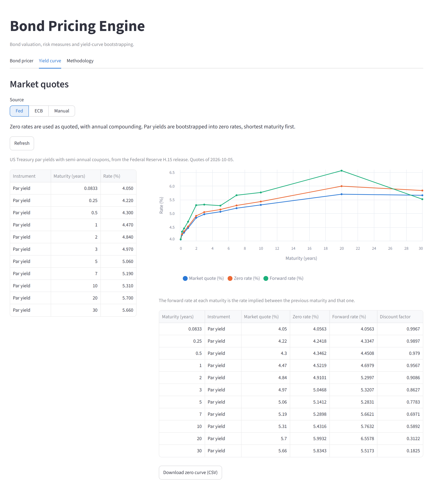

# Bond Pricing Engine

Excel's built-in bond functions price a fixed coupon bond from a single yield. They do not cover floating rate, amortising or callable bonds, and they cannot discount on a yield curve. This engine prices seven bond types in Python: it discounts each bond's cash flows on a flat yield or on a zero curve bootstrapped from live Federal Reserve or ECB quotes, and it values callable and putable bonds on a Ho-Lee binomial tree. On the bonds tested, the engine matches Excel's prices, accrued interest, yields and Macaulay durations to 10 decimal places, and the known differences are listed in the methodology note.

**[Open the live app](https://bond-pricing-engine.streamlit.app/)**



## What it does

- Prices seven bond types on a flat yield or on a zero curve plus a spread.
- Builds the zero curve from live US Treasury yields (Federal Reserve), live euro area spot rates (ECB), or quotes typed in or uploaded as CSV or Excel.
- Reports clean and dirty price, accrued interest, yields, duration, convexity and DV01.
- Backs out the spread and yield implied by a market price.
- Reprices the bond under parallel rate shifts from -300 to +300 basis points.

| Bond type | How it is valued |
|---|---|
| Fixed coupon, zero coupon | Discounted cash flows |
| Perpetual | Discounted coupons with a terminal value |
| Floating rate | Coupons projected from forward rates, discounted at the curve plus a margin |
| Step-up coupon | Discounted cash flows with a coupon schedule |
| Amortising | Discounted cash flows on a falling balance |
| Callable / putable | Ho-Lee binomial rate tree calibrated to the discount curve |

The formulas and model assumptions are in [docs/bond_valuation_methodology.md](docs/bond_valuation_methodology.md).

## Run it

```
pip install -r requirements.txt
streamlit run app.py
```

The live curves need an internet connection and no API key.

## Tests

```
python -m pytest
```

The 16 tests compare the engine with Microsoft Excel (`PRICE`, `ACCRINT`, `YIELD`, `DURATION`, `MDURATION`) and check pricing identities, such as the bootstrapped curve repricing its own inputs at par.

## Project layout

```
app.py                  Streamlit interface
bonds/
    daycount.py         Day count conventions and coupon schedules
    curve.py            Zero curve, bootstrapping, discount factors, forward rates
    market_data.py      Live quotes from the Federal Reserve and the ECB
    cashflows.py        Cash flows of each bond type
    tree.py             Binomial rate tree for callable and putable bonds
    pricing.py          Present value, yield and spread solvers
    risk.py             Duration, convexity, weighted average life
    valuation.py        Full valuation report for one bond
    original/           The first pricing script, kept unchanged
data/sample_curve.csv   Sample quotes for the manual curve
docs/                   Valuation methodology
tests/                  Checks against Excel and pricing identities
```
